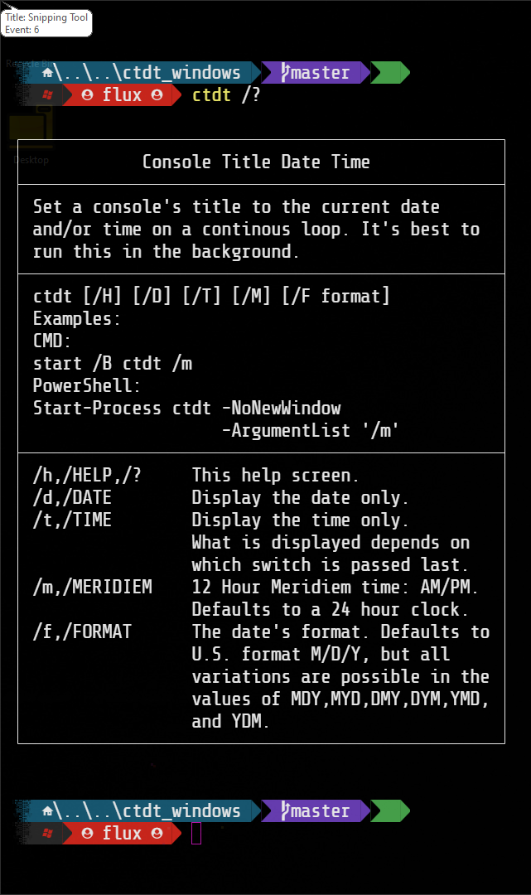

# Console Title Date Time for Windows

Change a console&#39;s title to the current time and date on a loop&#46; Windows version&#46;

- [Console Title Date Time for Windows](#console-title-date-time-for-windows)
  - [About](#about)
    - [Description](#description)
    - [Motivation](#motivation)
    - [Where To Get](#where-to-get)
  - [Usage](#usage)
    - [Environment and Information](#environment-and-information)
    - [Examples](#examples)
  - [MD5 Information](#md5-information)
    - [Current X86 MD5](#current-x86-md5)
    - [Current X64 MD5](#current-x64-md5)
  - [Media](#media)
  - [LICENSE](#license)

---

## About

All about this program and project&#46;

### Description

  
What is this&#63;

  

  This is a console tool for the <b>Windows</b> command line environment that sets the current console&#39;s title to the current date and time on a continuous loop with various options&#46; This works in <b><i>cmd</i></b> or <b><i>PowerShell</i></b>&#46;
  

### Motivation

  
Why did I write this&#63;

  

  I like to have the time and date visible in some command line environments depending on what I&#39;m doing and this is one way that helps me do so&#46; I&#39;m constantly in a comand line so it&#39;s nice to have the date and time close at hand&#46;

  I have written several scripts&#44; functions&#44; and applications like this over the years in Windows and Linux&#44; but this is the best I&#39;ve ever done for Windows so I&#39;m finally releasing it as a *stable*&#46; version&#46; Great performace and I&#39;m happy with it&#46; so here it is for anyone else if they care to use it&#46;
  

### Where To Get

  
Download or build&#46;

  

  You can fork this repository and build yourself or you can download it at the current <a href="https://github.com/Lateralus138/ctdt_windows/releases">Releases</a> page&#46;
  

---

## Usage

Where and how to use this program&#46;

### Environment and Information

  
Where do I use this&#63;

  

  Like any cli tool &#40;or any executable for that matter&#41; this can be used in any available command line program&#47;emulator in <b>Windows</b> like <b>CMD</b> or <b>PowerShell</b>&#44; for example&#44; and should work in most available terminals with only a few quirks &#40;not a bug&#44; I don't think&#41;&#46;

  For example in <b>Hyper Terminal</b> <a href="https://hyper.is/" target="_blank">ʰʸᵖᵉʳᶦᵒ</a> sometimes if you kill the process &#40;<i>ctdt.exe</i>&#41; it won't display again if you restart <b>ctdt</b> unless you restart Hyper itself and it doesn&#59;t happen always&#46; Doesn&#39;t seem to do that it anything else&#59; that I know of&#46;

  Like any portable program in this can either be placed somewhere in your <code>%PATH%</code> and if not then when your run it you&#39;ll need to provide the direct path of the executable&#46;
  

  <h4>Example Given</h4>
  <pre>
    <code> > & &#39;C:\Users\&#60;USERNAME&#62;\Bin\ctdt.exe&#39; /&#63; </code>
  </pre>

### Examples

  
Best methods&#46;

  

  Although this is a normal executable command line tool it can be used in various ways&#44; but the best way is to run it in the background of your&#44; console&#44; more than likely from a start up script&#47;config file or from a shortcut &#40;&#46;lnk&#41;&#44; but with the various methods and arguments&#47;parameters in the examples provided below&#46;
  

  
Get Help&#46;

  
In CMD or PowerShell&#46; &#40;with /?, /H, or /HELP&#41;&#46; You can also find a screenshot below&#46;

  <pre>
    <code>C:\Windows\System32> ctdt /?</code>
    <samp>
┌────────────────────────────────────────────────┐
│            Console Title Date Time             │
├────────────────────────────────────────────────┤
│ Set a console's title to the current date      │
│ and/or time on a continous loop. It's best to  │
│ run this in the background.                    │
├────────────────────────────────────────────────┤
│ ctdt [/H] [/D] [/T] [/M] [/F format]           │
│ Examples:                                      │
│ CMD:                                           │
│ start /B ctdt /m                               │
│ PowerShell:                                    │
│ Start-Process ctdt -NoNewWindow                │
│                    -ArgumentList '/m'          │
├────────────────────────────────────────────────┤
│ /h,/HELP,/?     This help screen.              │
│ /d,/DATE        Display the date only.         │
│ /t,/TIME        Display the time only.         │
│                 What is displayed depends on   │
│                 which switch is passed last.   │
│ /m,/MERIDIEM    12 Hour Meridiem time: AM/PM.  │
│                 Defaults to a 24 hour clock.   │
│ /f,/FORMAT      The date's format. Defaults to │
│                 U.S. format M/D/Y, but all     │
│                 variations are possible in the │
│                 values of MDY,MYD,DMY,DYM,YMD, │
│                 and YDM.                       │
└────────────────────────────────────────────────┘
    </samp>
  </pre>

  
CMD Examples&#46;

  
Good old fashion cmd&#46;exe&#46;

  
Start it in the background with Meridiem time while allowing more input&#46;

  <pre>
  <code>
  C:\Windows\System32> start /B ctdt /m
  </code>
  </pre>

  
PowerShell Examples&#46;

  
The more powerful PowerShell or PWSH&#46;

  
Start it in the background with Meridiem time while allowing more input&#46;

  <pre>
  <code>
  > Start-Process ctdt -NoNewWindow -ArgumentList '/m'
  </code>
  </pre>

---

## MD5 Information

This information is generated in a *GitHub Action* immediately after the successful build of this project.

### Current X86 MD5

### Current X64 MD5

---

## Media

<!-- ### Logo -->

  
Logo, the icon for this program&#46; 

  

  
Help, screenshot of the help screen&#46; 

  

<!-- ### Example Screenshots -->

---

## [LICENSE](./LICENSE)

  
License Excerpt

   
  <blockquote>
  This program is free software&#58; you can redistribute it and&#47;or modify it under the terms of the GNU General Public License as published by the Free Software Foundation&#44; either version 3 of the License&#44; or &#40;at your option&#41; any later version&#46;
  </blockquote>
   
  <blockquote>
  This program is distributed in the hope that it will be useful&#44; but WITHOUT ANY WARRANTY&#59; without even the implied warranty of MERCHANTABILITY or FITNESS FOR A PARTICULAR PURPOSE&#46;  See the GNU General Public License for more details&#46;
  </blockquote>

---

## Support Me If You Like

If you like this project and care to donate to my ***PayPal***:

Or ***Buy Me A Coffee*** if your prefer:

